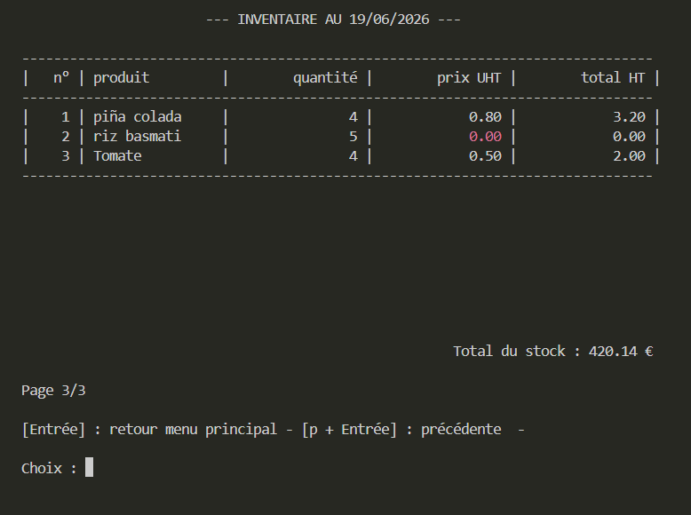

# Gestion de stock
Application de gestion de stock avec interface en ligne de commande (CLI)

## Description
Application de gestion simple d'un stock de produits (lister les produits, les alertes et l'inventaire, gérer l'ajout et la modification des produits) avec une architecture modulaire (séparation de la gestion métier, des données et des interactions avec l'utilisateur) et une sauvegarde des données dans un fichier stock.json.

## Structure du projet
```
gestion-stock-python/
|
|- images/
|  |- inventaire.png
|- main.py
|- constantes.py
|- donnees.py
|- gestion_stock.py
|- interface.py
|- types_structure.py
|- normalisation.py
|- suggestions_produits.py
|- README.md
|- .gitignore
```

## Format des données
Les données sont stockées sous forme d'une liste de dictionnaires :
```text
[
    {
        "nom": str,
        "quantite": int,
        "seuil": int,
        "prix": float
    }
]
```

## Technologies utilisées
- Python 3.10 ou supérieur
- Développé et testé avec Python 3.14
- JSON pour le stockage permanent et la portabilité des données
- Aucune dépendance externe (librairie standard Python uniquement)

## Fonctionnalités
- Affichage du stock
- Affichage des alertes (uniquement des produits dont la quantité est inférieure au seuil)
- Ajout / Modification avec une taille limite pour le nom du produit
- Suppression avec demande de confirmation
- Recherche insensible à la casse et aux accents avec proposition de suggestions
- Renommage avec vérification que le nouveau nom n'existe pas déjà dans la liste des produits
- Affichage de l'inventaire avec calcul du coût total du stock à la date du jour
- Tous les affichages (stock, alertes, inventaire) sont triés par ordre alphabétique avec une normalisation Unicode et une pagination
- Les valeurs nécessitant une attention particulière (prix nul, quantité inférieure au seuil) sont affichées en rouge

## Aperçus de l'interface
```text
                    --- ETAT DU STOCK ---                    

-------------------------------------------------------------
|   n° | produit         |        quantité |  seuil d'alerte |
-------------------------------------------------------------
|    1 | Fraise Tagada   |               2 |               5 |
|    2 | jus d'orange    |               0 |               0 |
|    3 | lait de coco    |               5 |               2 |
|    4 | noix de coco    |               3 |               1 |
|    5 | orange          |               3 |               1 |
|    6 | orange sanguine |               2 |               1 |
|    7 | orangeade       |               3 |               1 |
|    8 | orangina        |              30 |               5 |
|    9 | Pepsi Cola      |              10 |               3 |
|   10 | Pepsi orange    |               4 |               2 |
-------------------------------------------------------------


Page 2/3

[Entrée] : retour menu principal - [p + Entrée] : précédente  - [s + Entrée] : suivante

Choix : 
```


## Installation
```bash
git clone https://github.com/AnnickCang/gestion-stock-python.git
cd gestion-stock-python
```
### Création de l'environnement virtuel
```bash
python -m venv .venv
```

### Activation de l'environnement virtuel selon l'OS
**Windows**
```bash
.\.venv\Scripts\Activate.ps1
```
**Mac / Linux**
```bash
source .venv/bin/activate
```

## Lancement
```bash
python main.py
```

## Évolution du projet
Le projet évolue progressivement afin d'améliorer la robustesse, l'expérience utilisateur et l'architecture du code.

### v1.0 - Base fonctionnelle
- gestion des produits (ajout, modification, suppression)
- affichage du stock, des alertes et de l'inventaire
- sauvegarde des données dans un fichier JSON
- architecture modulaire initiale

### v1.1 - Robustesse + UX
- validation et nettoyage avancé du fichier `stock.json`
- contrôle de cohérence des données et gestion des cas invalides
- gestion des doublons
- normalisation Unicode pour comparaison et tri
- recherche tolérante avec suggestions
- amélioration des messages utilisateur
- navigation améliorée avec retour rapide au menu principal pendant une saisie
- refactorisation architecture / séparation des responsabilités
- amélioration de la maintenabilité du code

### v1.2 - Amélioration des affichages + UX (en cours)
- mise en évidence (texte en rouge) des valeurs problématiques (ex: prix nul, quantité inférieure au seuil)
- ajout d'une colonne en première position pour indiquer le numéro de ligne
- gestion de la pagination pour l'affichage du stock, des alertes et de l'inventaire (ex: 10 produits par page)
- amélioration de l'affichage (centrage, espacements, clarté des messages)
- implémentation de suggestions de noms de produits lors de la suppression ou du renommage
- création d'un fichier imprimable pour le stock, les alertes et l'inventaire
- revue des noms de fonctions
- amélioration du typage statique et de la robustesse du code
- enregistrement des anomalies dans un fichier texte
- gestion des clés inutilisées dans le fichier JSON (état actuel : supprimées silencieusement lors d'une sauvegarde) : afficher un warning
- version bilingue du fichier `README.md`
- traduction en anglais des commentaires du fichier `.gitignore`

### v2.0 - Migration vers Flask (à venir)
- migration de l'interface CLI vers une interface web avec Flask
- remplacement du stockage JSON par une base de données SQL
- renommage en anglais de toutes les appellations dans le code
- pour les données, remplacement de la liste de dictionnaires par un dictionnaire de dictionnaires
- ajout des champs `unité` et `type`
- modification du type des champs `quantite` et `seuil` en `float`
- possibilité d'affichage par type de produits
- possibilité de trier l'affichage autrement que par le nom du produit
- autocomplétion pour le nom du produit
- paramétrage de la longueur maximale du champ "nom"
- possibilité de définir le nombre maximum de produits suggérés lors d'une recherche
- affichage des valeurs existantes d'un produit lors de sa modification (champs pré-remplis)

## Auteur
Projet réalisé dans le cadre d'un apprentissage Python orienté reconversion professionnelle.