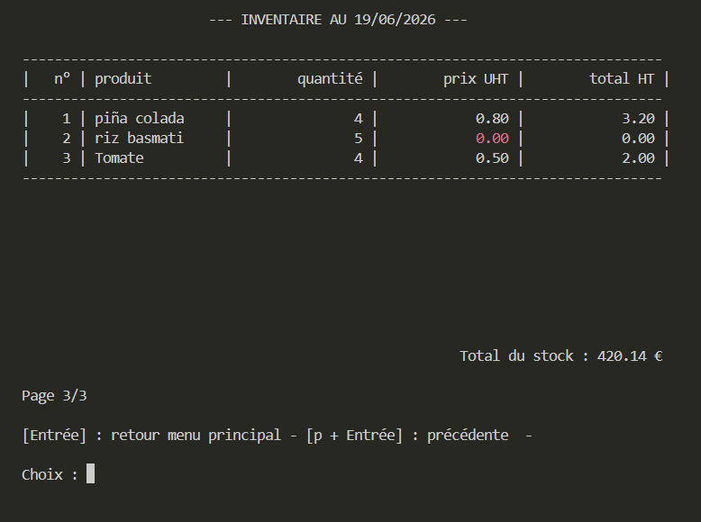

[Go to the English version](#stock-management)

# Gestion de stock
Application de gestion de stock avec interface en ligne de commande (CLI)

## Description
Application de gestion simple d'un stock de produits (lister les produits, les alertes et l'inventaire, gérer l'ajout et la modification des produits) avec une architecture modulaire (séparation de la gestion métier, des données et des interactions avec l'utilisateur) et une sauvegarde des données dans un fichier `stock.json`.

## Structure du projet
```
gestion-stock-python/
|
|- images/
|  |- inventaire.png
|- main.py
|- constantes.py
|- donnees.py
|- gestion_stock.py
|- interface.py
|- types_structure.py
|- normalisation.py
|- suggestions_produits.py
|- README.md
|- .gitignore
```

## Format des données
Les données sont stockées sous forme d'une liste de dictionnaires :
```text
[
    {
        "nom": str,
        "quantite": int,
        "seuil": int,
        "prix": float
    }
]
```

## Technologies utilisées
- Python 3.10 ou supérieur
- Développé et testé avec Python 3.14
- JSON pour le stockage permanent et la portabilité des données
- HTML/CSS pour la génération d'une version imprimable
- Aucune dépendance externe (librairie standard Python uniquement)

## Outils de développement
- Pylance : pour l'autocomplétion et la vérification du typage
- Ruff 0.16.3 : pour l'analyse statique du code (linting)

## Fonctionnalités
- Affichage du stock
- Affichage des alertes (uniquement des produits dont la quantité est inférieure au seuil)
- Ajout / Modification avec une taille limite pour le nom du produit
- Suppression avec demande de confirmation
- Recherche insensible à la casse et aux accents avec proposition de suggestions
- Renommage avec vérification que le nouveau nom n'existe pas déjà dans la liste des produits
- Affichage de l'inventaire avec calcul du coût total du stock à la date du jour
- Tous les affichages (stock, alertes, inventaire) sont triés par ordre alphabétique avec une normalisation Unicode et une pagination
- Les valeurs nécessitant une attention particulière (prix nul, quantité inférieure au seuil) sont affichées en rouge
- Génération d'un fichier HTML imprimable pour le stock, les alertes et l'inventaire depuis leur affichage respectif

## Aperçus de l'interface
```text
                    --- ETAT DU STOCK ---                    

-------------------------------------------------------------
|   n° | produit         |        quantité |  seuil d'alerte |
-------------------------------------------------------------
|   11 | fanta           |               3 |               5 |
|   12 | Fraise Tagada   |               2 |               5 |
|   13 | jus d'orange    |               0 |               0 |
|   14 | lait de coco    |               5 |               2 |
|   15 | noix de coco    |               3 |               1 |
|   16 | orange          |               3 |               1 |
|   17 | orange sanguine |               2 |               1 |
|   18 | orangeade       |               3 |               1 |
|   19 | orangina        |              30 |               5 |
|   20 | Pepsi Cola      |              10 |               3 |
-------------------------------------------------------------


Page 2/3

[Entrée] : retour au menu principal - [p + Entrée] : précédente  - [s + Entrée] : suivante
[g + Entrée] : générer une version imprimable

Choix : 
```


## Installation
```bash
git clone https://github.com/AnnickCang/gestion-stock-python.git
cd gestion-stock-python
```
### Création de l'environnement virtuel
```bash
python -m venv .venv
```

### Activation de l'environnement virtuel selon l'OS
**Windows**
```bash
.\.venv\Scripts\Activate.ps1
```
**Mac / Linux**
```bash
source .venv/bin/activate
```

## Lancement
```bash
python main.py
```

## Limite connue
L'application charge le contenu du fichier `stock.json` une seule fois au démarrage et travaille ensuite sur une copie des données en mémoire.
Ce fichier ne doit pas être modifié pendant l'exécution de l'application. Dans le cas contraire, les modifications externes risquent d'être écrasées lors de la prochaine sauvegarde effectuée par l'application.
Cette limitation est acceptée pour la v1.x, l'application étant destinée à un usage local mono-utilisateur.
La migration vers une base de données SQL permettra de mieux gérer cette problématique.


## Évolution du projet
Le projet évolue progressivement afin d'améliorer la robustesse, l'expérience utilisateur et l'architecture du code.

### v1.0 - Base fonctionnelle
- gestion des produits (ajout, modification, suppression)
- affichage du stock, des alertes et de l'inventaire
- sauvegarde des données dans un fichier JSON
- architecture modulaire initiale

### v1.1 - Robustesse + UX
- validation et nettoyage avancé du fichier `stock.json`
- contrôle de cohérence des données et gestion des cas invalides
- gestion des doublons
- normalisation Unicode pour comparaison et tri
- recherche tolérante avec suggestions
- amélioration des messages utilisateur
- navigation améliorée avec retour rapide au menu principal pendant une saisie
- refactorisation architecture / séparation des responsabilités
- amélioration de la maintenabilité du code

### v1.2 - Amélioration des affichages + UX
- mise en évidence (texte en rouge) des valeurs problématiques (ex: prix nul, quantité inférieure au seuil)
- ajout d'une colonne en première position pour indiquer le numéro de ligne
- gestion de la pagination pour l'affichage du stock, des alertes et de l'inventaire (ex: 10 produits par page)
- amélioration de l'affichage (centrage, espacements, clarté des messages)
- création d'un fichier imprimable pour le stock, les alertes et l'inventaire
- revue des noms de fonctions
- amélioration du typage statique et de la robustesse du code
- enregistrement des anomalies dans un fichier texte
- gestion des clés inutilisées dans le fichier JSON (suppression de ces clés et mention dans le fichier d'anomalies)
- version bilingue du fichier `README.md`
- traduction en anglais des commentaires du fichier `.gitignore`

### v2.0 - Migration vers Flask (en cours)
- migration de l'interface CLI vers une interface web avec Flask
- remplacement du stockage JSON par une base de données SQL
- renommage en anglais de toutes les appellations dans le code
- ajout des champs `unite` et `type`
- modification du type du champ `prix` en un type adapté aux montants financiers
- modification du type des champs `quantite` et `seuil` en un type adapté aux valeurs décimales
- possibilité d'affichage par type de produits
- possibilité de trier l'affichage autrement que par le nom du produit
- autocomplétion pour le nom du produit
- paramétrage de la longueur maximale du champ "nom"
- possibilité de définir le nombre maximum de produits suggérés lors d'une recherche
- affichage des valeurs existantes d'un produit lors de sa modification (champs pré-remplis)
- mise en place d'un système de journalisation pour faciliter le diagnostic des erreurs imprévues

## Auteur
Projet réalisé dans le cadre d'un apprentissage Python orienté reconversion professionnelle.


[Aller à la version française](#gestion-de-stock)
# Stock management
Stock management application with a command-line interface (CLI)

## Description
Simple product stock management application (displays the stock, alerts, and inventory, handles product addition and modification), using a modular architecture (business logic, data management and user interactions are separated) and a JSON file `stock.json` for data storage.

## Project structure
```
gestion-stock-python/
|
|- images/
|  |- inventaire.png
|- main.py
|- constantes.py
|- donnees.py
|- gestion_stock.py
|- interface.py
|- types_structure.py
|- normalisation.py
|- suggestions_produits.py
|- README.md
|- .gitignore
```

## Data structure
Data is stored as a list of dictionaries:
```text
[
    {
        "nom": str,
        "quantite": int,
        "seuil": int,
        "prix": float
    }
]
```

## Technologies used
- Python 3.10 or later
- Developed and tested with Python 3.14
- JSON for permanent data storage and portability
- HTML/CSS for generating printable versions
- No external libraries (Python standard library only)

## Development tools
- Pylance: for autocompletion and type checking
- Ruff 0.16.3: for static code analysis (linting)

## Features
- Stock display
- Alerts display (products with a quantity below threshold only)
- Add / Update a product with a maximum name length
- Deletion with confirmation request
- Case- and accent-insensitive search with suggestions
- Rename a product while checking that the new name is not already in use
- Inventory display with the total stock value as of the current date
- Stock, alerts, and inventory are displayed paginated in alphabetical order, with Unicode normalization
- Values requiring special attention (zero price, quantity below threshold) are displayed in red
- Printable HTML files can be generated from the stock, alerts, and inventory views

## Interface previews
```text
                    --- ETAT DU STOCK ---                    

-------------------------------------------------------------
|   n° | produit         |        quantité |  seuil d'alerte |
-------------------------------------------------------------
|   11 | fanta           |               3 |               5 |
|   12 | Fraise Tagada   |               2 |               5 |
|   13 | jus d'orange    |               0 |               0 |
|   14 | lait de coco    |               5 |               2 |
|   15 | noix de coco    |               3 |               1 |
|   16 | orange          |               3 |               1 |
|   17 | orange sanguine |               2 |               1 |
|   18 | orangeade       |               3 |               1 |
|   19 | orangina        |              30 |               5 |
|   20 | Pepsi Cola      |              10 |               3 |
-------------------------------------------------------------


Page 2/3

[Entrée] : retour au menu principal - [p + Entrée] : précédente  - [s + Entrée] : suivante
[g + Entrée] : générer une version imprimable

Choix : 
```


## Installation
```bash
git clone https://github.com/AnnickCang/gestion-stock-python.git
cd gestion-stock-python
```
### Virtual environment creation
```bash
python -m venv .venv
```

### Virtual environment activation by OS
**Windows**
```bash
.\.venv\Scripts\Activate.ps1
```
**Mac / Linux**
```bash
source .venv/bin/activate
```

## Launching
```bash
python main.py
```

## Known limitation
The application loads the contents of the `stock.json` file once at startup and then works with the data stored in memory. 
This file must not be modified while the application is running. Otherwise, external updates may be overwritten the next time the application saves the data.
This limitation is accepted for v1.x because the application is intended for local, single-user use.
Migrating to a SQL database will provide better ways to handle this issue.


## Project roadmap
The project is developed progressively to improve robustness, user experience and code architecture. 

### v1.0 - Functional base
- product management (add, update, delete)
- stock, alerts and inventory display
- data saved in a JSON file
- initial modular architecture

### v1.1 - Robustness + UX
- advanced validation and cleaning of the `stock.json` file
- checking data consistency and handling invalid cases
- duplicate handling
- Unicode normalization for comparison and sorting
- search with suggestions
- improved user messages
- navigation improved with quick return to the main menu during user input
- refactored architecture / separation of responsibilities
- improved code maintainability

### v1.2 - Display and UX improvements
- problematic values (e.g., zero price, quantity below threshold) are highlighted in red
- addition of a first column displaying the row number
- pagination is added for stock, alerts, and inventory displays (e.g., 10 products per page)
- display improvements (alignment, spacing, clearer messages)
- generation of printable files for stock, alerts, and inventory
- function names reviewed
- static typing and code robustness improved
- anomalies are saved to a text file
- handling of unused keys in the JSON file (these keys are deleted and mentioned in the anomalies file)
- bilingual version of `README.md`
- `.gitignore` file comments translated into English

### v2.0 - Migration to Flask (in progress)
- migration from CLI interface to a Flask web interface
- JSON file will be replaced by a SQL database
- rename code identifiers into English
- add `unite` and `type` fields
- `prix` field updated with a type adapted for financial amounts
- `quantite` and `seuil` fields updated with a type adapted for decimals
- option to display products by type
- displays can be sorted by criteria other than product names
- autocomplete for product names
- product name maximum length can be configured
- configurable maximum number of product suggestions
- pre-filled fields when updating a product
- add logging to help diagnose unexpected errors

## Author
This project was developed as part of my Python learning journey and career transition.